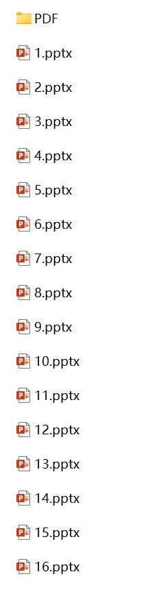
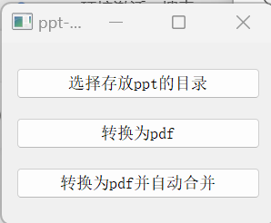
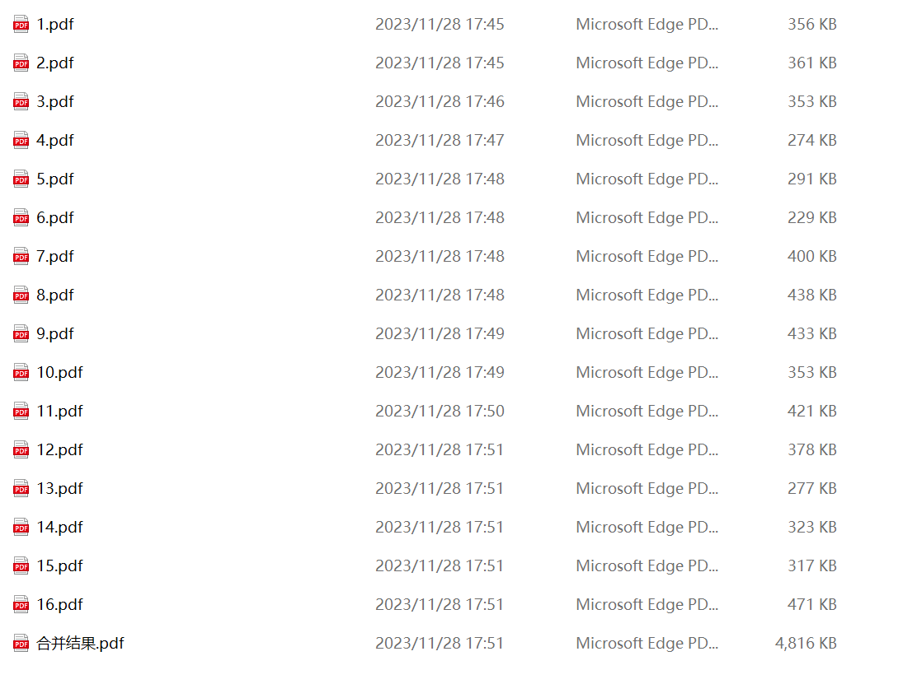

# 一键ppt-pdf转换及合并器 食用方法

## 一、功能

1.将一个文件夹中的ppt批量转换为pdf

2.将一个文件夹中的ppt批量转换为pdf并合并

## 二、食用方法

1.事先将你要进行转换的ppt放入一个文件夹,并在该文件夹中创建一个名为"PDF"的文件夹，用于存放转换后的pdf文件

2.将你要转换的ppt按照顺序，重命名为1.pptx、2.pptx、3.pptx......(或者.ppt也可以)

3.打开“一键ppt-pdf转换和合并器.exe”

4.点击选择存放ppt目录选择刚才存放ppt的文件夹

5.选择转换为pdf，程序将会将文件夹中所有ppt转换为pdf并放入/PDF子文件夹中

6.选择转换为pdf并自动合并，程序将会将文件夹中所有ppt转换为pdf并放入/PDF子文件夹中，并在/PDF子文件夹中生成一个合并结果.pdf

版本v1.1

后期想要添加的功能

一键导入，自动重命名

单独的pdf合并功能

更丰富的GUI界面
